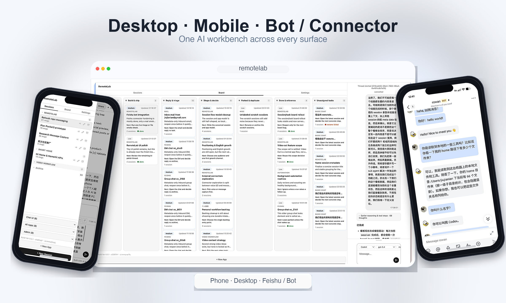
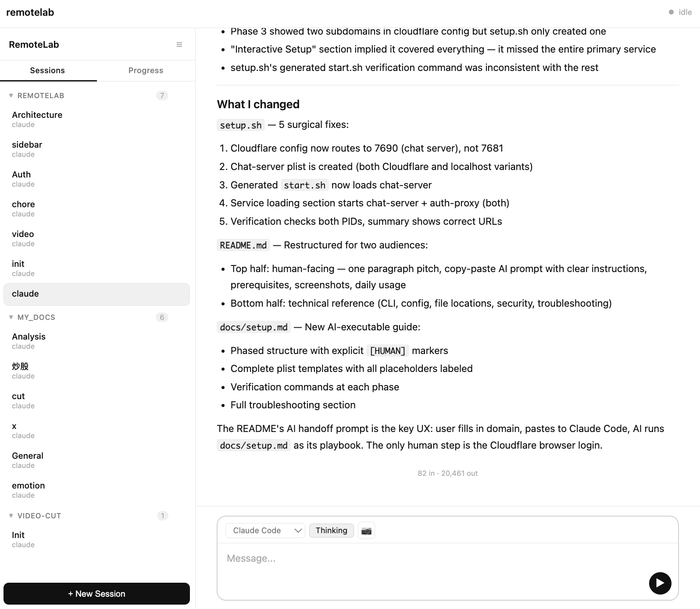

# Cue

[English](README.md) | 中文

**让人的出现更稀少、更值钱、更从容的 AI 工作控制面。**

Cue 不是一个让 AI 更会干活的产品，而是一个让人更少需要出现的产品。它像一个几乎隐形的调度台：AI 线程在真实机器上长时间自主推进，系统持续落盘、持续整理上下文、持续维持线程之间的可见性；人默认不在场，只在少数真正需要价值判断、方向选择、批准风险、确认交付的时刻被精准唤起。



> 当前基线：`v0.3` —— owner-first 的 session 编排、落盘的持久历史、可替换的 executor adapter、typed attention contract，以及同时兼容手机和桌面的无构建 Web UI。

## 快速安装

如果上面的 demo 已经说明白了，那就别往下看了。直接在部署机器上开一个新的终端，启动 Codex、Claude Code 或其他 coding agent，然后把下面这段 prompt 粘贴进去：

```text
我想在这台机器上配置 Cue，这样我就能从不同设备控制 AI worker，并把长时间运行的 AI 工作组织起来。

网络模式：[cloudflare | tailscale]

# Cloudflare 模式：
我的域名：[YOUR_DOMAIN]
我想用的子域名：[SUBDOMAIN]

# Tailscale 模式：
（无需额外配置——宿主机和我想使用的客户端设备都已安装 Tailscale，并在同一个 tailnet 中。）

请把 `https://raw.githubusercontent.com/Ninglo/remotelab/main/docs/setup.md` 当作配置契约和唯一真相来源。
不要假设这个仓库已经提前 clone 到本地。如果 `~/code/remotelab` 还不存在，请你先读取那份契约，再自行 clone `https://github.com/Ninglo/remotelab.git`，然后继续完成安装。
后续流程都留在这个对话里。
开始执行前，请先用一条消息把缺少的上下文一次性问全，让我集中回复一次。
能自动完成的步骤请直接做。
我回复后，请持续自主执行；只在真的遇到 [HUMAN] 步骤、授权确认或最终完成时停下来。
停下来时，请明确告诉我具体要做什么，以及我做完后你会怎么验证。
```

如果你想先看更完整的说明，可以跳到 [安装细节](#安装细节) 或直接打开 `docs/setup.md`。

---

## 给人类看的部分

### 愿景

Cue 的理想形态，不是一个"更会干活的 AI 产品"，而是一个"更少打扰人的 AI 工作控制面"。

它服务于一个具体场景：一个 single owner 在真实世界里同时推进很多长任务。他让几个 AI 分别写代码、验收、查资料、跑脚本、修环境、整理文档，自己离开电脑去开会、走路、吃饭，偶尔只用手机看一眼：哪个线程卡住了，哪里需要拍板，哪个交付已经能收，哪个方向要改。手机在这里不是"移动版 IDE"，而是口袋里的判断面和审批面；桌面也不是为了让人重新手工操作一遍，而是为了在少数需要更深介入时快速落下去。

### 基础判断

- 单轮任务的 scope 会持续放大：从分钟级，到小时级，再到天级，甚至周级。
- 并发会成为默认状态：想最大化 AI 生产效率，人就会同时跑越来越多 Agent。
- 人类记忆会成为瓶颈：几个小时后任务回来时，人需要的是上下文快速恢复，而不是原始日志堆砌。
- 项目编排会成为个人基础设施：并发线程一多，就必须有人机协同地处理优先级、阻塞点和跟进节奏。
- 分发是下游方向，不是起点：当某类 workflow 被 owner 反复验证有效后，才应该被包装成 App 或薄外部入口进行分发——但这是已验证协作协议的延伸，不是一开始就奔着平台化铺开。

### Cue 是什么

- 一个几乎隐形的 AI 工作调度台，架在强执行器之上
- 一个面向并发 AI 线程的注意力管理与编排层
- 一个帮助人类在长任务中恢复上下文的外置记忆系统
- 一个不锁定具体端形态、让手机和桌面都能做判断的 Web 控制面

### Cue 不是什么

- 终端模拟器
- 传统的 editor-first IDE
- 通用多用户聊天 SaaS
- 一套试图在单任务执行层面正面超越 `codex` / `claude` 的闭环执行栈

### 产品主线与延伸方向

**主线：单任务执行器之上的注意力管理与任务编排。** Cue 帮 owner 管理自己正在推进的全量 AI 工作线程：开更多并发、更快恢复上下文、更合理分配注意力、只在高价值判断点被唤起，并尽可能提高最终质量与效率。Cue 卖的不是 execution，本质上卖的是 judgment timing、context recovery 和 interruption economy。

**延伸方向（下游，非当前主线）：** 当某类 workflow 被 owner 反复验证有效后，Cue 允许它被包装成 App 或通过薄外部适配器分发。但这是已验证协作协议的分发，不是起点就奔着平台化和多入口铺开。

### 产品语法

当前产品模型刻意保持简单：

- `Session` —— 持久化的工作线程
- `Run` —— 会话内部的一次执行尝试
- `App` —— 启动会话用的可复用 workflow / policy package
- `Share snapshot` —— 不可变的只读会话导出

这些模型背后的架构假设是：

- HTTP 是规范状态路径，WebSocket 只负责提示“有东西变了”
- 浏览器是控制面，不是系统事实来源
- 运行时进程可以丢，持久状态必须落在磁盘上
- 产品默认单 owner，visitor 访问通过 `Apps` 进行 scope 控制
- 前端保持轻量、无框架，并兼容不同端的使用方式

### 产品边界

Cue 的边界很硬：

- **不重造执行器。** Cue 不应该把主要精力花在优化单任务 Agent 内部实现上。
- **不做终端模拟器、重编辑器、重 dashboard。** 浏览器是控制面和判断面，不是工作台。
- **不默认创造新的注意力来源。** 不为了"更主动"而主动找人、不为了"更自动化"而悄悄替人做决定、不为了"更多入口"而把自己扩成一堆外部 connector 产品线。
- **外部入口可以存在，但只能是薄适配器。** 不能反过来定义产品本体。
- **自动化可以存在，但只能延长 AI 自主运行时间、减少人类出现频次。** 不能把系统推向 engagement machine。
- **接入最强工具，并保持可替换。** 让更强执行器出现时可以被快速接入，不把自己做成闭环 runtime。

判断一个功能该不该存在，最后只问一句就够了：**它是在减少 owner 需要出现的次数和成本，还是在给 owner 新增一个需要持续管理的世界。** 前者是 Cue，后者就不是了。

### 你现在可以做什么

- 用手机或桌面端发消息，让 agent 在真实机器上执行
- 浏览器断开后依然保留持久化历史
- 在控制面重启后恢复长时间运行的工作
- 让 agent 自动生成会话标题和侧边栏分组
- 直接往聊天里粘贴截图
- 界面自动跟随系统亮色 / 暗色外观
- 生成不可变的只读分享快照
- 用 App 链接做 visitor 范围内的入口流转

### Provider 说明

- Cue 现在把 `Codex`（`codex`）作为默认内置工具，并放到选择器最前面。
- 这并不意味着“执行器选择本身就是产品”。恰恰相反：Cue 应该保持 adapter-first，把当前最强的本地执行器接进来。
- 对这种自托管控制面来说，API key / 本地 CLI 风格的集成通常比基于消费级登录态的远程封装更稳妥。
- `Claude Code` 依然可以在 Cue 里使用；其他兼容的本地工具也可以接入，前提是它们的认证方式和服务条款适合你的实际场景。
- 长期目标是 executor portability，而不是绑定某一个闭环 runtime。
- 实际风险通常来自底层提供商的认证方式和服务条款，而不只是某个 CLI 的名字本身。是否接入、是否继续用，请你自行判断。

### 安装细节

最快的方式仍然是：把一段 setup prompt 粘贴给部署机器上的 Codex、Claude Code 或其他靠谱的 coding agent。它可以自动完成绝大多数步骤，只会在 Cloudflare 登录这类真正需要人工参与的地方停下来（仅当你选择 Cloudflare 模式时）。

这个仓库里的配置类和功能接入类文档都按同一个原则来写：人只需要把 prompt 发给自己的 AI agent，Agent 会尽量在最开始一轮把需要的上下文都问清楚，然后后续流程都留在那段对话里，只有明确标记为 `[HUMAN]` 的步骤才需要人离开对话手工处理。

最优雅的模式就是一次性交接：Agent 先一轮收齐信息，人回一次；之后 Agent 自己连续完成剩余工作，除非真的需要人工授权、浏览器操作、校验确认或最终验收。

**粘贴前的前置条件：**
- **macOS**：已安装 Homebrew + Node.js 18+
- **Linux**：Node.js 18+
- 至少安装了一个 AI 工具（`codex`、`claude`、`cline` 或兼容的本地工具）
- **网络**（二选一）：
  - **Cloudflare Tunnel**：域名已接入 Cloudflare（[免费账号](https://cloudflare.com)，域名约 ¥10–90/年，可从 Namecheap 或 Porkbun 购买）
  - **Tailscale**：[个人使用免费](https://tailscale.com)——宿主机和你想使用的各个客户端设备都安装 Tailscale 并加入同一个 tailnet，无需域名

**在宿主机开一个新的终端，启动 Codex 或其他 coding agent，然后粘贴这段 prompt：**

```text
我想在这台机器上配置 Cue，这样我就能从不同设备控制 AI worker，并把长时间运行的 AI 工作组织起来。

网络模式：[cloudflare | tailscale]

# Cloudflare 模式：
我的域名：[YOUR_DOMAIN]
我想用的子域名：[SUBDOMAIN]

# Tailscale 模式：
（无需额外配置——宿主机和我想使用的客户端设备都已安装 Tailscale，并在同一个 tailnet 中。）

请把 `https://raw.githubusercontent.com/Ninglo/remotelab/main/docs/setup.md` 当作配置契约和唯一真相来源。
不要假设这个仓库已经提前 clone 到本地。如果 `~/code/remotelab` 还不存在，请你先读取那份契约，再自行 clone `https://github.com/Ninglo/remotelab.git`，然后继续完成安装。
后续流程都留在这个对话里。
开始执行前，请先用一条消息把缺少的上下文一次性问全，让我集中回复一次。
能自动完成的步骤请直接做。
我回复后，请持续自主执行；只在真的遇到 [HUMAN] 步骤、授权确认或最终完成时停下来。
停下来时，请明确告诉我具体要做什么，以及我做完后你会怎么验证。
```

如果你想看完整的配置契约和人工节点说明，请直接看 `docs/setup.md`。

### 配置完成后你会得到什么

在你想使用的设备上打开 Cue 地址：
- **Cloudflare**：`https://[subdomain].[domain]/?token=YOUR_TOKEN`
- **Tailscale**：`http://[hostname].[tailnet].ts.net:7690/?token=YOUR_TOKEN`



- 新建一个本地 AI 工具会话，默认优先使用 Codex
- 默认从 `~` 开始，也可以让 agent 切到其他仓库路径
- 发送消息时，界面会在后台不断重新拉取规范 HTTP 状态
- 关掉浏览器后再回来，不会丢失会话线程
- 生成不可变的只读会话分享快照
- 按需配置基于 App 的 visitor 流程和推送通知

### 日常使用

配置完成后，服务可以在开机时自动启动（macOS LaunchAgent / Linux systemd）。你平时只需要在手机或桌面端打开网址。

```bash
remotelab start
remotelab stop
remotelab restart chat
```

## 文档地图

如果你是经历了很多轮架构迭代后重新回来看，现在推荐按这个顺序读：

1. `README.md` / `README.zh.md` —— 产品概览、安装路径、日常操作
2. `docs/project-architecture.md` —— 当前已落地架构和代码地图
3. `docs/README.md` —— 文档分层和同步规则
4. `notes/current/core-domain-contract.md` —— 当前领域模型 / 重构基线
5. `notes/README.md` —— 笔记分桶和清理规则
6. `docs/setup.md`、`docs/creating-apps.md` 等专题文档

---

## 架构速览

Cue 当前的落地架构已经稳定在：一个主 chat 控制面、detached runners，以及落盘的持久状态。

| 服务 | 端口 | 职责 |
|------|------|------|
| `chat-server.mjs` | `7690` | 生产可用的主 chat / 控制面 |

```
浏览器 / 客户端入口                    浏览器 / 客户端入口
   │                                      │
   ▼                                      ▼
Cloudflare Tunnel                    Tailscale (VPN)
   │                                      │
   ▼                                      ▼
chat-server.mjs (:7690)             chat-server.mjs (:7690)
   │
   ├── HTTP 控制面
   ├── 鉴权 + 策略
   ├── session/run 编排
   ├── 持久化历史 + run 存储
   ├── 很薄的 WS invalidation
   └── detached runners
```

当前最重要的架构规则：

- `Session` 是主持久对象，`Run` 是它下面的执行对象
- 浏览器状态始终要回收敛到 HTTP 读取结果
- WebSocket 是无效化通道，不是规范消息通道
- 之所以能在控制面重启后恢复活跃工作，是因为真正的状态在磁盘上
- 开发 Cue 自身时，`7690` 就是唯一默认 chat/control plane；现在依赖干净重启后的恢复能力，而不是常驻第二个验证服务

完整代码地图和流程拆解请看 `docs/project-architecture.md`。

外部渠道的可选集成契约请看 `docs/external-message-protocol.md`（这是 opt-in 的扩展能力，不是主线默认行为）。

---

## CLI 命令

```text
remotelab setup                运行交互式配置向导
remotelab start                启动所有服务
remotelab stop                 停止所有服务
remotelab restart [service]    重启：chat | tunnel | all
remotelab chat                 前台运行 chat server（调试用）
remotelab generate-token       生成新的访问 token
remotelab set-password         设置用户名和密码登录
remotelab --help               显示帮助
```

## 配置项

| 变量 | 默认值 | 说明 |
|------|--------|------|
| `CHAT_PORT` | `7690` | Chat server 端口 |
| `CHAT_BIND_HOST` | `127.0.0.1` | Chat server 监听地址（`127.0.0.1` 用于 Cloudflare / 仅本机访问，`0.0.0.0` 用于 Tailscale 或局域网访问） |
| `SESSION_EXPIRY` | `86400000` | Cookie 有效期（毫秒，24h） |
| `SECURE_COOKIES` | `1` | Tailscale 或本地 HTTP 访问时设为 `0`（无 HTTPS） |
| `REMOTELAB_INSTANCE_ROOT` | 未设置 | 可选的额外实例数据根目录；设置后默认使用 `<root>/config` + `<root>/memory` |
| `REMOTELAB_CONFIG_DIR` | `~/.config/remotelab` | 可选的运行时数据/配置目录覆盖，包含 auth、sessions、runs、apps、push、provider runtime home |
| `REMOTELAB_MEMORY_DIR` | `~/.remotelab/memory` | 可选的用户 memory 目录覆盖，供 pointer-first 启动使用 |

## 常用文件位置

下面这些是未设置实例覆盖变量时的默认路径。

| 路径 | 内容 |
|------|------|
| `~/.config/remotelab/auth.json` | 访问 token + 密码哈希 |
| `~/.config/remotelab/auth-sessions.json` | Owner / visitor 登录会话 |
| `~/.config/remotelab/chat-sessions.json` | Chat 会话元数据 |
| `~/.config/remotelab/chat-history/` | 每个会话的事件存储（`meta.json`、`context.json`、`events/*.json`、`bodies/*.txt`） |
| `~/.config/remotelab/chat-runs/` | 持久化 run manifest、spool 输出和最终结果 |
| `~/.config/remotelab/apps.json` | App 模板定义 |
| `~/.config/remotelab/shared-snapshots/` | 不可变的只读会话分享快照 |
| `~/.remotelab/memory/` | pointer-first 启动时使用的机器私有 memory |
| `~/Library/Logs/chat-server.log` | Chat server 标准输出 **(macOS)** |
| `~/Library/Logs/cloudflared.log` | Tunnel 标准输出 **(macOS)** |
| `~/.local/share/remotelab/logs/chat-server.log` | Chat server 标准输出 **(Linux)** |
| `~/.local/share/remotelab/logs/cloudflared.log` | Tunnel 标准输出 **(Linux)** |

## 安全

- **Cloudflare 模式**：通过 Cloudflare 提供 HTTPS（边缘 TLS，机器侧仍是本地 HTTP）；服务只绑定 `127.0.0.1`
- **Tailscale 模式**：流量由 Tailscale 的 WireGuard mesh 加密；服务绑定 `0.0.0.0`（所有接口），因此端口也可从局域网/公网访问——在不可信网络中，建议配置防火墙将 `7690` 端口限制为 Tailscale 子网（如 `100.64.0.0/10`）
- `256` 位随机访问 token，做时序安全比较
- 可选 scrypt 哈希密码登录
- `HttpOnly` + `Secure` + `SameSite=Strict` 的认证 cookie（Tailscale 模式下关闭 `Secure`）
- 登录失败按 IP 限流，并做指数退避
- 默认服务只绑定 `127.0.0.1`，不直接暴露到公网；如需局域网访问，设置 `CHAT_BIND_HOST=0.0.0.0`
- 分享快照是只读的，并与 owner 聊天面隔离
- CSP 头使用基于 nonce 的脚本白名单

## 手动起第二实例

- `scripts/chat-instance.sh` 现在除了旧的 `--home` 模式，也支持 `--instance-root`、`--config-dir`、`--memory-dir`。
- 如果你想让第二实例继续复用当前机器的 provider 登录状态、但把 Cue 自己的数据和 memory 完全隔离，优先用 `--instance-root`。
- 示例：`scripts/chat-instance.sh start --port 7692 --name companion --instance-root ~/.remotelab/instances/companion --secure-cookies 1`

## 故障排查

**服务启动失败**

```bash
# macOS
tail -50 ~/Library/Logs/chat-server.error.log

# Linux
journalctl --user -u remotelab-chat -n 50
tail -50 ~/.local/share/remotelab/logs/chat-server.error.log
```

**DNS 还没解析出来**

配置完成后等待 `5–30` 分钟，再执行：

```bash
dig SUBDOMAIN.DOMAIN +short
```

**端口被占用**

```bash
lsof -i :7690
```

**重启单个服务**

```bash
remotelab restart chat
remotelab restart tunnel
```

---

## License

MIT
